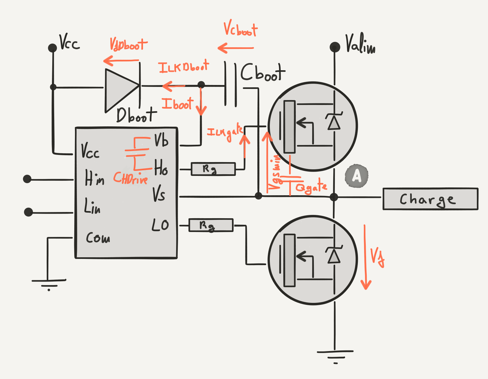

# Technical requirements

* LiPo 2S to 4S
  * At full charge: Vddmax = 4 * 4.2V = 16.8V
  * At minimum charge: Vddmin = 2 * 3.6V = 7.2V
* 100A maximum current
* 128kHz PWM frequency.

## Why not higher number of LiPo cells?

RC Car races are regulated by the ROARR, which states that electric RC cars
should use 2S only. Therefore 4S is already out of norm, which means that
most model car engines don't hold that voltage already.

## Why 100A?
Because it is the golden dream of any RC car owner. Anyway - I don't really
believe that this small circuit will hold that amount of current. Something
is going to break or melt before.

## Why 128kHz?

# Selection of components

## Power N-MOSFET transistor

As size is very limited, I've chosen a dual MOSFET package. As I want as much
power as I can, and I'm not yet trying to squeeze out the pennies, I've
chosen a rather big component.

Relevant characteristics are:
* https://www.vishay.com/docs/68442/sqjq904e.pdf
* Maximum tolerated gate-to-source: ``Vgsmax`` = 20V (page 1 of data sheet)
* Maximum tolerated drain-to-source: ``Vdsmax`` = 40V (page 1 of data sheet)
* Minimum gate-to-source to have good conduction: ``Vgsmin`` = 5V (page 3 of data sheet)
* Gate charge ``Qg`` = 75nC
* Gate-source leakage: ``Igss`` = 100nA

## Capacitors
To minimise the number of different components (still not trying to squeeze out
the pennies, but it makes the hand assembly easier when you've got less different
pieces), I'm choosing KEMET's X7R series, which are not very expensive, and are
appropriate for bypass and decoupling applications.

Also, I'm soldering by hand, so I don't want to use a package smaller
than C0402.

* https://content.kemet.com/datasheets/KEM_C1002_X7R_SMD.pdf
* Insulation resistance for capacitors above 0.012µF:
  * ``IR``= 500 MΩ µF
  * or 10GΩ
  * _To obtain IR limit, divide MΩ - μF value by the capacitance and compare to GΩ limit_
  * Page 13

## Diodes
Because I'm familiar with it, its high availability, and acceptable forward
voltage drop, I'm choosing the BAT48ZFILM:

* https://www.st.com/content/ccc/resource/technical/document/datasheet/b2/2f/2a/0c/8b/b5/46/a3/CD00130229.pdf/files/CD00130229.pdf/jcr:content/translations/en.CD00130229.pdf
* Forward voltage drop:
  * At 0.1mA: ``Vf`` = 0.25V
* Reverse leakage current:
  * At 20V: ``Ilk`` = 5µA

## High / Low side MOSFET driver

I'm quite familiar with the IR2301SPBF‎, which is commonly available, not too
expensive, available as DIP and SMD and, most importantly, it supports small
``Vcc``:

* https://www.infineon.com/dgdl/ir2301.pdf?fileId=5546d462533600a4015355c97bb216dc
* VCC and VBS supply under-voltage going threshold: ``Vccuv`` = 5V
* Quiescent VBS supply current: ``Iqbs`` = 100µA

# Circuit design

## Bootstrap capacitor

To calculate the value of the bootstrap capacitor, one must understand how the
high side / low side driver works.

For the high side transistor to be on, the gate has to be on a higher potential
than the source:

While the low side is in conduction, ``Vs`` is at ground. The capacitor _Cboot_ is
charged at Vcc through the diode _Dboot_ (minus its forward voltage):

When the low side stops conducting, what happens to the potential at point ``A``
depends on what the other bridges and the rest of the circuit do. What is certain is,
because the _Cboot_ cannot discharge itself due to the _Dboot_ diode, ``Vb``will
follow it on top of the capacitor:

The potential in ``Vb`` feeds the internal circuitry that produces the ``Ho`` output. When
the moment comes, ``Ho`` can make the high side to enter in conduction provided that:

This condition has to hold as long as the high side is on. At a frequency of
128kHz, considering an unrealistic duty cycle of 100%, the maximum time the
high side needs to keep conducting is:

During this period, the only source of power is the charge stored in _Cboot_, and
it has to provide for:

* Leaking currents:
  * _Cboot_ leaking through the insulation resistance:
    * Assuming a capacitor of 0.1µA (can correct that later)
    * ``IRcboot`` = 500 MΩ / 0.1µA = 5GΩ
    * At 10V: ``ILKCboot`` = 2nA
  * _Dboot_ diode's reverse leaking current: ``ILKDboot`` = 5µA
  * Transistor's gate leaking: ``Igss`` = 100nA
  * Current consumed by the internal circuitry that produces the ``Ho`` signal:
    * Quiescent VBS supply current: ``Iqbs`` = 100µA
* Gate charges:Charging the gate of the high side transistor:
  * ``Qg`` = 75nC

The charge lost by _Cboot_ by the end of the ``thon`` period is the sum of all
of the above:

By comparing at the different leakage currents, the only significant one
is the quiescent Vbs supply current, 100µA, which is 20 times greater than the
next in significance, which is the diode reverse leaking current, 5µA. So we can
say:

When replacing actual values, we see again that none of that counts but
the transistor's gate charge:

Because of the ``Qboot`` charge lost during the high on time, by the
end of the high on period, the voltage in _Cboot_ will be:

And this has to be enough to keep the high side transistor on:

Replacing the values to have the complete expression, gives us:

Operating we can come up with:

And thus:

Taking in count the tolerance of 10%, plus some margin, we can safely use
0.1µF capacitors for the bootstrap circuit.
